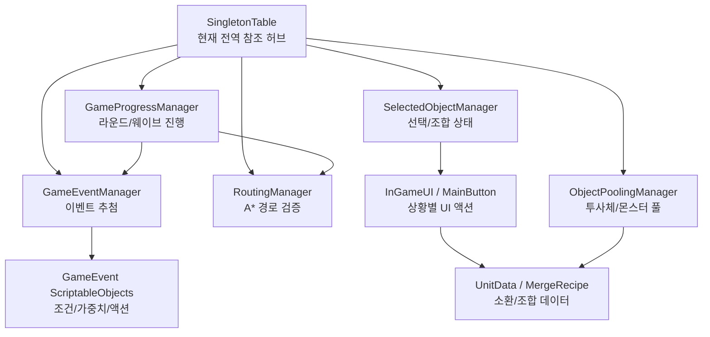

# Unity Defense Project

Unity 기반 2D 디펜스 게임 프로젝트입니다. 플레이어는 그리드 위에 성을 건설하고 유닛을 소환하며, 라운드마다 등장하는 이벤트와 웨이브에 대응합니다.

## Gameplay GIF

> 포트폴리오 제출 전 `Docs/portfolio/gameplay-demo.gif` 위치에 실제 플레이 GIF를 추가하면 됩니다.

## 주요 기능

- 그리드 기반 성 건설 및 경로 차단 검증
- 라운드, 브레이크 타임, 웨이브 진행 관리
- 유닛 소환, 선택, 이동, 조합 흐름
- ScriptableObject 기반 게임 이벤트와 선택지 액션
- 투사체/광역 공격 오브젝트 풀링
- 인게임 UI 창 정렬, 키 바인딩, 드래그 앤 드롭 UI

## 구조 다이어그램

## 핵심 코드 링크

- [라운드와 웨이브 진행](Assets/02Scripts/00Manager_Scripts(Singleton)/InGame_Manager_Scripts/01GameEnvironmentGroup/GameProgressManager.cs)
- [A* 기반 경로 검증](Assets/02Scripts/00Manager_Scripts(Singleton)/InGame_Manager_Scripts/01GameEnvironmentGroup/RoutingManager.cs)
- [이벤트 추첨 관리](Assets/02Scripts/00Manager_Scripts(Singleton)/InGame_Manager_Scripts/01GameEnvironmentGroup/GameEventManager.cs)
- [조건/가중치 기반 공지 이벤트](Assets/03ScirptableObjects/01GameEventScripts/01NoticeEvent/BaseClass/NoticeGameEvent.cs)
- [선택지 이벤트 처리](Assets/03ScirptableObjects/01GameEventScripts/01NoticeEvent/BaseClass/ChoiceNoticeGameEvent.cs)
- [이벤트 액션 베이스](Assets/03ScirptableObjects/01GameEventScripts/02Actions/GameEventAction.cs)
- [플레이어 스탯 변경 액션](Assets/03ScirptableObjects/01GameEventScripts/02Actions/ChangePlayerStatAction.cs)
- [오브젝트 선택과 조합 상태 관리](Assets/02Scripts/00Manager_Scripts(Singleton)/InGame_Manager_Scripts/02GamePlayerGroup/SelectedObjectManager.cs)
- [인게임 버튼 상태 갱신](Assets/02Scripts/01Component_Scripts/04UI%20Components/02InGameUIObjects/ButtonScripts/MainButton.cs)
- [유닛 공격과 투사체 생성](Assets/02Scripts/01Component_Scripts/01Unit%20Components/Attack.cs)
- [광역 공격 연출](Assets/02Scripts/01Component_Scripts/03ChildObject%20Components/Meteor.cs)
- [유닛 조합 레시피](Assets/03ScirptableObjects/00UnitDataScripts/UnitMergeRecipeList.cs)

## 포트폴리오에서 강조할 점

- `ScriptableObject`로 이벤트 조건, 가중치, 선택지 액션을 분리해 데이터 중심으로 확장할 수 있게 구성했습니다.
- 성 건설 전 `RoutingManager.CheckPath`로 몬스터 경로가 막히는지 사전 검증합니다.
- 유닛 선택, 다중 선택, 조합 가능 여부를 `SelectedObjectManager`에서 관리하고 UI 버튼 상태와 연결했습니다.
- 투사체와 몬스터 생성에 오브젝트 풀링을 사용해 런타임 Instantiate 비용을 줄이는 구조를 적용했습니다.

## 현재 구조의 한계와 개선 방향

현재 프로젝트는 `SingletonTable`을 중심으로 매니저 간 참조를 빠르게 연결합니다. 작은 규모에서는 Inspector 연결 비용을 줄일 수 있지만, 기능이 늘수록 시스템 간 결합도가 높아지고 테스트와 교체가 어려워집니다.

개선 방향은 다음과 같습니다.

- 게임 진행, UI, 입력, 이벤트 시스템 사이에 인터페이스 또는 이벤트 채널을 두어 직접 참조를 줄이기
- `SingletonTable`을 전역 접근 지점이 아니라 초기 부트스트랩/컨텍스트 주입 역할로 축소하기
- 이벤트 액션과 플레이어 스탯 변경 로직을 더 작은 서비스로 분리해 단위 테스트 가능하게 만들기
- 디버그 로그는 개발 빌드 전용 로거로 분리하고, 릴리즈 코드에는 경고/오류 로그만 남기기
